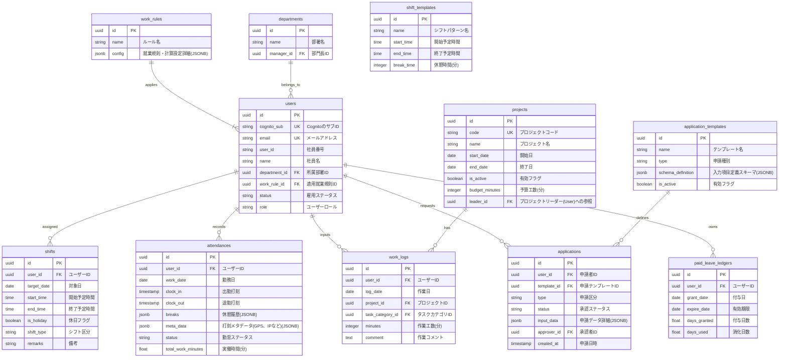

# HRConnect DB設計書

## 1. ER図 (Entity Relationship Diagram)

本システムは、複雑な集計クエリ（勤怠・シフト・工数の突合）を高速化するリレーショナル設計と、柔軟なルール設定や動的申請フォームを可能にする JSONB 型をハイブリッドで採用しています。



---

## 2. テーブル定義 (Table Definitions)

### 2.1 `users`（ユーザー・従業員マスタ）
| 物理名 | 論理名 | データ型 | 制約 | 説明 |
| :--- | :--- | :--- | :--- | :--- |
| `id` | ユーザーID | `UUID` | `PRIMARY KEY` | システム内の一意なID |
| `cognito_sub` | Cognito ID | `VARCHAR(255)` | `UNIQUE`, `NOT NULL` | AWS Cognitoの認証IDと紐付け |
| `email` | メールアドレス | `VARCHAR(255)` | `UNIQUE`, `NOT NULL` | 連絡先およびログインキー |
| `user_id` | 社員番号 | `VARCHAR(50)` | `NULL` | 企業内の社員番号等 |
| `name` | 社員氏名 | `VARCHAR(100)` | `NOT NULL` | フルネーム |
| `department_id` | 所属部署ID | `UUID` | `FOREIGN KEY` (departments) | 組織階層の紐付け |
| `work_rule_id` | 適用就業規則ID | `UUID` | `FOREIGN KEY` (work_rules) | 勤怠・丸め計算ルールの紐付け |
| `status` | ステータス | `VARCHAR(20)` | `NOT NULL` | `Active` (在籍中), `Retired` (退職) |
| `role` | システムロール | `VARCHAR(30)` | `NOT NULL` | `Admin`, `Manager`, `Leader`, `HR_Payroll`, `Employee` |

### 2.2 `work_rules`（就業規則定義テーブル）
| 物理名 | 論理名 | データ型 | 制約 | 説明 |
| :--- | :--- | :--- | :--- | :--- |
| `id` | 就業規則ID | `UUID` | `PRIMARY KEY` | - |
| `name` | 規則名 | `VARCHAR(100)` | `NOT NULL` | 例: 「正社員」「パート・アルバイト」 |
| `config` | 規則設定詳細 | `JSONB` | `NOT NULL` | 丸め設定、自動休憩、36協定閾値の定義 |

### 2.3 `attendances`（勤怠実績テーブル）
| 物理名 | 論理名 | データ型 | 制約 | 説明 |
| :--- | :--- | :--- | :--- | :--- |
| `id` | 実績ID | `UUID` | `PRIMARY KEY` | - |
| `user_id` | ユーザーID | `UUID` | `FOREIGN KEY` (users), `NOT NULL` | 打刻対象者 |
| `work_date` | 勤務日 | `DATE` | `NOT NULL` | 勤務日付（深夜勤務時も業務日ベースで管理） |
| `clock_in` | 出勤打刻時刻 | `TIMESTAMP` | `NULL` | - |
| `clock_out` | 退勤打刻時刻 | `TIMESTAMP` | `NULL` | - |
| `breaks` | 休憩履歴 | `JSONB` | `NOT NULL` | 休憩の開始/終了のリストを保持 |
| `meta_data` | メタデータ | `JSONB` | `NOT NULL` | 打刻時のGPS座標（緯度経度）、IP、デバイス等 |
| `status` | 勤怠ステータス | `VARCHAR(20)` | `NOT NULL` | `Present` (出勤), `Late` (遅刻), `Early` (早退), `Absence` (欠勤) |
| `total_work_minutes` | 実働時間（分）| `DOUBLE PRECISION` | `NOT NULL` | 丸め処理・休憩控除後の正味実働時間 |

---

## 3. JSONB フィールドの詳細スキーマ定義

Pydantic バリデーションおよびフロントエンド描画に用いられる、主要な JSONB フィールドのスキーマ仕様です。

### 3.1 `work_rules.config`
```json
{
  "$schema": "http://json-schema.org/draft-07/schema#",
  "type": "object",
  "properties": {
    "rounding_rule_minutes": {
      "type": "integer",
      "description": "打刻の丸め単位（分）。例: 15（出勤は切り上げ、退勤は切り捨て）",
      "default": 1
    },
    "auto_break_deduction_minutes": {
      "type": "integer",
      "description": "自動休憩控除時間（分）。例: 60（実働が一定時間を超えた場合に自動適用）",
      "default": 0
    },
    "late_grace_period_minutes": {
      "type": "integer",
      "description": "遅刻判定の猶予時間（分）。例: 5",
      "default": 0
    },
    "overtime_thresholds": {
      "type": "array",
      "description": "36協定に基づく残業時間警告閾値のリスト",
      "items": {
        "type": "object",
        "properties": {
          "month_hours": { "type": "integer", "description": "残業時間閾値（時間）。例: 45" },
          "period_start_date": { "type": "string", "format": "date", "description": "適用開始日" },
          "period_end_date": { "type": "string", "format": "date", "description": "適用終了日" }
        },
        "required": ["month_hours", "period_start_date", "period_end_date"]
      }
    }
  },
  "required": ["rounding_rule_minutes", "auto_break_deduction_minutes"]
}
```

### 3.2 `attendances.breaks`
```json
{
  "type": "array",
  "items": {
    "type": "object",
    "properties": {
      "start": { "type": "string", "format": "date-time", "description": "休憩開始時刻 (ISO 8601 UTC)" },
      "end": { "type": "string", "format": "date-time", "description": "休憩終了時刻 (ISO 8601 UTC)" }
    },
    "required": ["start", "end"]
  }
}
```

### 3.3 `attendances.meta_data`
```json
{
  "type": "object",
  "properties": {
    "gps": {
      "type": "object",
      "properties": {
        "latitude": { "type": "number", "description": "緯度" },
        "longitude": { "type": "number", "description": "経度" },
        "accuracy": { "type": "number", "description": "精度精度（メートル）" }
      },
      "required": ["latitude", "longitude"]
    },
    "ip_address": { "type": "string", "format": "ipv4", "description": "打刻元IPアドレス" },
    "device_info": { "type": "string", "description": "ユーザーエージェントなどのブラウザ情報" }
  }
}
```

---

## 4. インデックス設計 (Index Design)

集計処理およびログイン時・打刻時のルックアップを最適化するため、以下のインデックスを定義します。

1. **`users` テーブル**:
   * `idx_users_cognito_sub`: `cognito_sub` の一意性検索（ログイン認証時のユーザー識別）を高速化。
2. **`attendances` テーブル**:
   * `idx_attendances_user_date`: `(user_id, work_date)` の複合ユニークインデックス。1人のユーザーが1日に作成できる勤怠レコードは1つのみというビジネスルールをデータベースレベルで強制し、勤怠画面や集計処理を高速化。
3. **`work_logs` テーブル**:
   * `idx_work_logs_user_date`: `(user_id, log_date)` のインデックス。日報工数の取得および整合性バリデーション（勤怠との突合）を高速化。
4. **`shifts` テーブル**:
   * `idx_shifts_user_date`: `(user_id, target_date)` の複合ユニークインデックス。予定シフトのルックアップおよび遅刻判定の高速化。

---

## 5. AWS DynamoDB シングルテーブル設計 (Single Table Design)

本システムは、本番環境においてAWSの完全サーバーレスNoSQLデータベースである **Amazon DynamoDB** を採用しており、インフラコストの最適化と高速なキー・バリュールックアップを実現するために「シングルテーブル設計（Single Table Design）」を導入しています。

### 5.1 基本キー定義
* **PK (Partition Key)**: データの種類や所有ユーザーを特定するパーティションキー（文字列型）
* **SK (Sort Key)**: データの詳細区分や一意のIDを示すソートキー（文字列型）
* **GSI1 (Global Secondary Index 1)**: SKをパーティションキー、PKをソートキーとして反転させたインデックス。これにより、特定のデータ種別を跨いだ検索や、逆引き検索を効率的に行います。

### 5.2 エンティティとキーのマッピング定義
DynamoDBの単一テーブル内において、各データは以下のPKおよびSKを用いて格納されます。

| エンティティ / データ種別 | PK (Partition Key) | SK (Sort Key) | 主要属性 / 説明 |
| :--- | :--- | :--- | :--- |
| **ユーザー情報 (User Metadata)** | `USER#<cognito_sub>` | `METADATA` | `id`, `cognito_sub`, `email`, `name`, `role`, `status`, `work_rule_id` |
| **有給休暇台帳 (Leave Ledger)** | `USER#<cognito_sub>` | `LEAVE_LEDGER#<id>` | `id`, `user_id`, `leave_type_id`, `grant_date`, `expire_date`, `days_granted`, `days_used` |
| **休暇区分マスタ (Leave Type)** | `LEAVE_TYPE#<id>` | `METADATA` | `id`, `name`, `is_paid`, `is_system` |
| **勤怠実績 (Attendance)** | `USER#<cognito_sub>` | `ATTENDANCE#<work_date>` | `id`, `work_date`, `clock_in`, `clock_out`, `breaks` (JSON), `status` |
| **予定シフト (Shift)** | `USER#<cognito_sub>` | `SHIFT#<target_date>` | `id`, `target_date`, `start_time`, `end_time`, `is_holiday`, `shift_type` |

### 5.3 日付形式の統一規約
システム全体における整合性を保ち、ブラウザ環境による表示の乱れを防ぐため、以下の日付規約を定義し、変更を禁止します。

* **データベース内保存形式**: 
  - DynamoDBおよびSQLite（移行元・ローカル環境用）のテーブルに格納する日付データは、すべて **`YYYY-MM-DD`** 形式の文字列、または ISO 8601 形式のタイムスタンプ（例: `2026-06-12`）とします。
* **画面表示・入力形式**: 
  - フロントエンドの画面およびフォームにおける日付の表示・入力は、すべて **`YYYY/MM/DD`** 形式（例: `2026/06/12`）に統一します。
  - ブラウザのロケール設定により自動的に日付表示が切り替わる HTML 標準の `<input type="date">`（「MM/DD/YYYY」などになる恐れがある）の使用は一切禁止し、専用のカスタム `DateInput` コンポーネントを使用します。

### 5.4 SQLite と DynamoDB のデータ同期
* 開発用およびテスト用にローカルの `hr_connect.db` (SQLite) が存在します。
* `backend/scripts/sync_sqlite_to_dynamodb.py` を実行することにより、SQLiteのローカルデータを読み込み、DynamoDB（ローカルの DynamoDB Local または AWS/GCP 本番用 DynamoDB テーブル）へマッピングルールに従って同期を行います。
