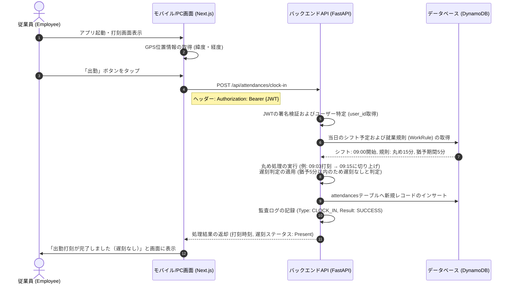
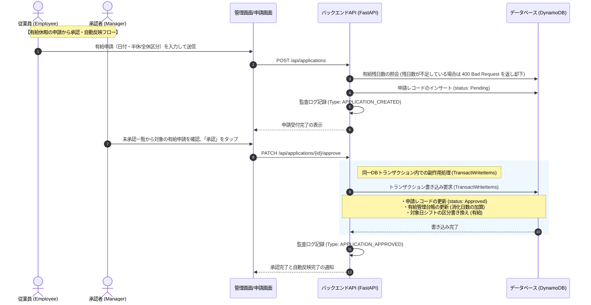
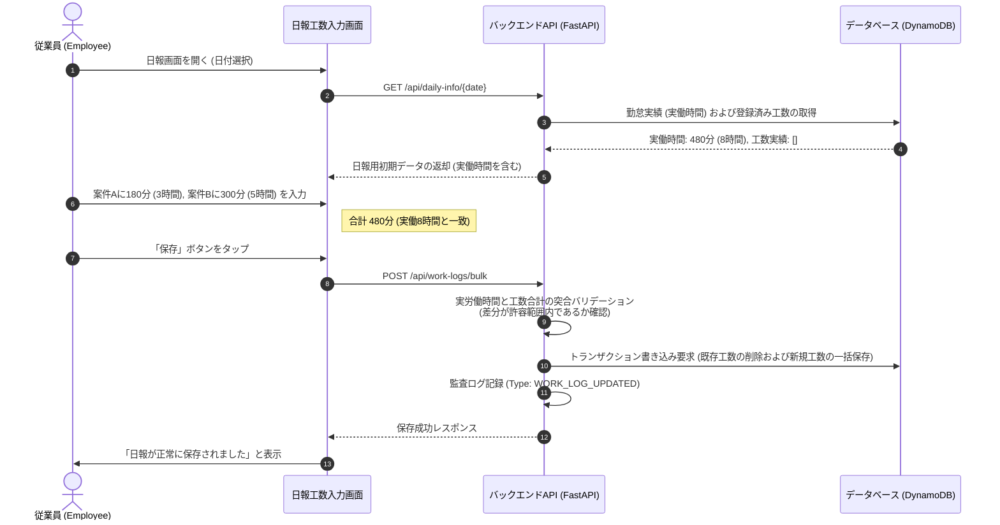

# HRConnect 機能設計書

## 1. 主要ユースケース (Use Cases)

本システムは、従業員の自律的な打刻・工数入力と、管理者の迅速なシフト・承認管理を支援するための4つの主要ユースケースを軸に設計されています。

---

## 2. 詳細業務フローとシーケンス

### 2.1 打刻と予実判定フロー (Stamping & Verification)
ユーザーがスマートフォンやPCから打刻した際、システムはバックエンドで即座にその日のシフト予定と適用就業規則を突合し、遅刻判定および出退勤時間の丸め計算を実行します。
公休または全日休暇の対象日は打刻不可となります。

### 2.2 申請承認と自動反映フロー (Workflow & Side Effects)
各種届出（有給休暇申請や打刻修正申請など）が承認された場合、データベースの同一トランザクション内で副作用（Side Effects）を実行し、実績データや有給台帳に即時かつ整合性を保って反映します。

### 2.3 工数入力とバリデーション (Man-hour Input & Validation)
従業員が1日の終わりに日報工数を入力する際、当日の実際の労働時間と工数の合計に乖離がないかをリアルタイムで検証します。

---

## 3. 画面一覧 (Screens List)

### 3.1 一般従業員向け画面
1. **ログイン画面**: Cognito連携によるメール・パスワード認証、MFAコード入力。
2. **打刻画面（スマートフォン対応）**: GPS位置情報を利用した出勤・退勤・休憩開始・休憩戻り打刻。
   * **打刻制限**: 公休（休日シフト）または全日休暇の対象日は、画面上の打刻ボタンが無効化され、打刻不可となります。
3. **シフトカレンダー**: 月次の確定シフト予定および有給取得日のカレンダー表示。
4. **申請起票画面**: 有給、残業、打刻修正などの申請作成フォーム（選択した申請種別に応じて動的にフォームが切り替わる）。
   * **日付形式の統一**: すべての日付入力フォームは、ブラウザロケールに依存しない `YYYY/MM/DD` 形式のカスタムカレンダー入力（`DateInput` 等）を使用します。
   * **半休申請の制限**: 開始日のみ入力可能とし、開始日として入力した値を自動的に終了日にセットして申請します。
   * **全日休暇申請の制限**: 開始日 ＞ 終了日の申請はエラーとして却下されます。また、シフトが休日（公休）の日に申請しようとした際は申請不可の旨メッセージを表示します。
   * **打刻修正申請**: デフォルト値として、元の打刻時間に関わらず当日のシフト時間がセットされた状態になります。
5. **日報・工数入力画面**: 日付を選択し、その日の実働時間を見ながらプロジェクト別の作業時間を入力・保存する画面。

### 3.2 管理者・労務向け画面
1. **承認一覧画面**: 未承認の申請（有給・残業・打刻修正）の確認、一括承認・却下・差し戻し操作。
2. **シフト作成画面**: 部門メンバー of 月次シフトのグリッド編集およびテンプレートの一括適用。
3. **36協定アラート画面**: 残業時間上限に近づいているメンバーを視覚的（赤・黄色アラート）に一覧表示するダッシュボード。
4. **有給管理画面**: ユーザーごとの有給台帳表示および新規有給付与処理。
   * **表示順の固定**: 休暇区分の表示順は「有給休暇」→「特別休暇」→「代休」の順に固定されます。
   * **新規休暇付与**: デフォルトの休暇区分は「有給休暇」になります。
   * **日付入力**: 付与日の日付形式は `YYYY/MM/DD` に統一されます。
5. **月次締め・エクスポート画面**: 月次データの締めロック処理、および給与計算CSVやプロジェクト別工数Excelの出力ダウンロード。

---

## 4. API インタフェース定義 (API Interface)

すべてのAPIエンドポイントは `Authorization: Bearer <Cognito JWT>` による認可を必須とします。また、管理者機能にはロール制限（`Depends(check_admin_role)` 等）を付与します。

### 4.1 認証・ユーザー関連
* **`GET /api/users/me`**: 自身のプロファイル情報および所属部署、ロールの取得。

### 4.2 勤怠・打刻関連
* **`POST /api/attendances/clock-in`**: 出勤打刻。
  * リクエスト: `{ "timestamp": "ISO-8601", "meta_data": { "gps": { "latitude": float, "longitude": float } } }`
* **`POST /api/attendances/clock-out`**: 退勤打刻。
* **`POST /api/attendances/break-start`**: 休憩開始打刻。
* **`POST /api/attendances/break-end`**: 休憩終了打刻。

### 4.3 ワークフロー関連
* **`POST /api/applications`**: 新規申請起票。
  * リクエスト: `{ "template_id": "UUID", "type": "PaidLeave|Overtime|StampCorrection", "input_data": { ... } }`
* **`PATCH /api/applications/{id}/approve`**: 申請承認（管理者専用）。
* **`PATCH /api/applications/{id}/reject`**: 申請却下（管理者専用）。

### 4.4 工数管理関連
* **`POST /api/work-logs/bulk`**: 1日の工数実績の一括保存。
  * リクエスト: `{ "log_date": "YYYY-MM-DD", "logs": [ { "project_id": "UUID", "task_category_id": "UUID", "minutes": integer } ] }`

### 4.5 API通信における日付データの仕様
* APIリクエストおよびレスポンス時のJSON内における日付は、すべて標準的な **`YYYY-MM-DD`** 形式の文字列（例: `2026-06-12`）またはISOタイムスタンプを使用します。フロントエンド側で表示時に `YYYY/MM/DD` 形式へ変換され、送信時に `YYYY-MM-DD` へ正規化されて送信されます。
