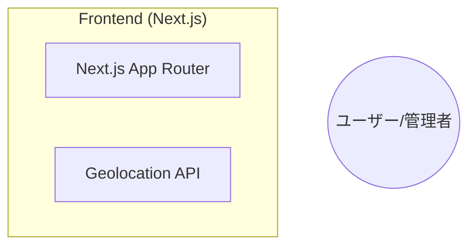
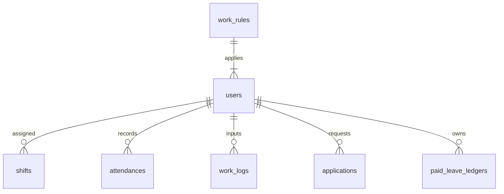

# ドキュメント & プロジェクト共通設定 仕様詳細書

本ドキュメントは、HRConnectにおける「ドキュメント & プロジェクト共通設定」カテゴリに属する全ファイルの仕様・構成・詳細を網羅した資料です。

**対象ファイル数:** 53 ファイル

---

## 掲載ファイル一覧

- [`.antigravityrules`](#-antigravityrules) : .antigravityrules モジュール / 設定ファイル
- [`.cursorrules`](#-cursorrules) : .cursorrules モジュール / 設定ファイル
- [`.env`](#-env) : .env モジュール / 設定ファイル
- [`.gitignore`](#-gitignore) : .gitignore モジュール / 設定ファイル
- [`architecture_diagram.md`](#architecture_diagram-md) : design.md
- [`aws_deployment_step_by_step_guide.html`](#aws_deployment_step_by_step_guide-html) : aws_deployment_step_by_step_guide.html モジュール / 設定ファイル
- [`aws_serverless_architecture.html`](#aws_serverless_architecture-html) : aws_serverless_architecture.html モジュール / 設定ファイル
- [`backend/.dockerignore`](#backend--dockerignore) : .dockerignore モジュール / 設定ファイル
- [`backend/Dockerfile`](#backend-Dockerfile) : Dockerfile モジュール / 設定ファイル
- [`backend/alembic/README`](#backend-alembic-README) : README モジュール / 設定ファイル
- [`backend/alembic/env.py`](#backend-alembic-env-py) : env.py モジュール / 設定ファイル
- [`backend/alembic/script.py.mako`](#backend-alembic-script-py-mako) : script.py.mako モジュール / 設定ファイル
- [`backend/alembic/versions/0d3446f2df76_add_skill_columns_to_project.py`](#backend-alembic-versions-0d3446f2df76_add_skill_columns_to_project-py) : Add skill columns to Project
- [`backend/alembic/versions/25eaaa692760_fix_schema.py`](#backend-alembic-versions-25eaaa692760_fix_schema-py) : fix schema
- [`backend/alembic/versions/294a7a977840_add_hashed_password_to_user.py`](#backend-alembic-versions-294a7a977840_add_hashed_password_to_user-py) : Add hashed_password to User
- [`backend/alembic/versions/2a1d7c636fef_add_hourly_rate_to_user.py`](#backend-alembic-versions-2a1d7c636fef_add_hourly_rate_to_user-py) : Add hourly_rate to user
- [`backend/alembic/versions/33b1f50c310c_add_project_role.py`](#backend-alembic-versions-33b1f50c310c_add_project_role-py) : Add project role
- [`backend/alembic/versions/40c2ff2543e3_add_user_id_to_user.py`](#backend-alembic-versions-40c2ff2543e3_add_user_id_to_user-py) : Add user_id to User
- [`backend/alembic/versions/52f523s89h2_add_settings.py`](#backend-alembic-versions-52f523s89h2_add_settings-py) : add settings to application template
- [`backend/alembic/versions/74e490ef0b95_add_difficulty_and_category_to_projects.py`](#backend-alembic-versions-74e490ef0b95_add_difficulty_and_category_to_projects-py) : add_difficulty_and_category_to_projects
- [`backend/alembic/versions/8ddd255f0cd9_add_leave_types_and_ledgers.py`](#backend-alembic-versions-8ddd255f0cd9_add_leave_types_and_ledgers-py) : Add leave types and ledgers
- [`backend/alembic/versions/aac66402b735_add_status_to_shift.py`](#backend-alembic-versions-aac66402b735_add_status_to_shift-py) : Add status to shift
- [`backend/alembic.ini`](#backend-alembic-ini) : A generic, single database configuration.
- [`backend/app/__init__.py`](#backend-app-__init__-py) : __init__.py モジュール / 設定ファイル
- [`backend/app/tests/test_dynamodb.py`](#backend-app-tests-test_dynamodb-py) : DynamoDB非同期セッション・リソース管理 & テーブル初期化
- [`backend/mypy.ini`](#backend-mypy-ini) : mypy.ini モジュール / 設定ファイル
- [`backend/pytest.ini`](#backend-pytest-ini) : pytest.ini モジュール / 設定ファイル
- [`backend/requirements.txt`](#backend-requirements-txt) : requirements.txt モジュール / 設定ファイル
- [`design.md`](#design-md) : design.md
- [`distribution_guide.md`](#distribution_guide-md) : Windows向けアプリケーション配布・起動手順書
- [`docker-compose.yml`](#docker-compose-yml) : docker-compose.yml モジュール / 設定ファイル
- [`docs/basic_design.md`](#docs-basic_design-md) : HRConnect 基本設計書
- [`docs/database_design.md`](#docs-database_design-md) : HRConnect DB設計書
- [`docs/development_guide.md`](#docs-development_guide-md) : HRConnect 改修指南書 (開発者向けガイド)
- [`docs/functional_design.md`](#docs-functional_design-md) : HRConnect 機能設計書
- [`docs/maintenance_manual.md`](#docs-maintenance_manual-md) : HRConnect メンテナンス手順書
- [`docs/operation_specs.md`](#docs-operation_specs-md) : HRConnect 運用仕様書
- [`docs/requirements_definition.md`](#docs-requirements_definition-md) : HRConnect 要件定義書
- [`frontend/.dockerignore`](#frontend--dockerignore) : .dockerignore モジュール / 設定ファイル
- [`frontend/.gitignore`](#frontend--gitignore) : .gitignore モジュール / 設定ファイル
- [`frontend/Dockerfile`](#frontend-Dockerfile) : Dockerfile モジュール / 設定ファイル
- [`frontend/components.json`](#frontend-components-json) : components.json モジュール / 設定ファイル
- [`frontend/eslint.config.mjs`](#frontend-eslint-config-mjs) : eslint.config.mjs モジュール / 設定ファイル
- [`frontend/next.config.ts`](#frontend-next-config-ts) : next.config.ts モジュール / 設定ファイル
- [`frontend/package.json`](#frontend-package-json) : package.json モジュール / 設定ファイル
- [`frontend/playwright.config.ts`](#frontend-playwright-config-ts) : playwright.config.ts モジュール / 設定ファイル
- [`frontend/postcss.config.mjs`](#frontend-postcss-config-mjs) : postcss.config.mjs モジュール / 設定ファイル
- [`frontend/src/middleware.ts`](#frontend-src-middleware-ts) : middleware.ts モジュール / 設定ファイル
- [`frontend/tsconfig.json`](#frontend-tsconfig-json) : tsconfig.json モジュール / 設定ファイル
- [`frontend/vitest.config.ts`](#frontend-vitest-config-ts) : vitest.config.ts モジュール / 設定ファイル
- [`frontend/vitest.setup.ts`](#frontend-vitest-setup-ts) : vitest.setup.ts モジュール / 設定ファイル
- [`system_specification_and_improvements.md`](#system_specification_and_improvements-md) : HRConnect 実装改善ポイント（AIエージェント向け）
- [`system_structure_and_specs.md`](#system_structure_and_specs-md) : design.md

---

## <a id="-antigravityrules"></a> .antigravityrules

- **ファイル概要:** .antigravityrules モジュール / 設定ファイル
- **行数:** 29 行
- **カテゴリ:** ドキュメント & プロジェクト共通設定

### コード先頭プレビュー
```text
# General Behavior
- You are an expert AI software engineer.
- **ALWAYS communicate in Japanese.**
- Explain your thought process and plans in Japanese.

# Language Rules for Code & Documents
1. **Chat & Explanations**: Japanese (日本語).
2. **Documentation (README, Specs, Markdown)**: Japanese (日本語).
3. **Code Comments**: Japanese (日本語).
4. **Variable/Function/Class Names**: English (Use standard English naming conventions like camelCase, snake_case). **DO NOT** use Japanese for code identifiers.

# Output Style
- When generating code, ensure inline comments explain complex logic in Japanese.
- When creating a plan or task list, write it in Japanese.

```

---

## <a id="-cursorrules"></a> .cursorrules

- **ファイル概要:** .cursorrules モジュール / 設定ファイル
- **行数:** 26 行
- **カテゴリ:** ドキュメント & プロジェクト共通設定

### コード先頭プレビュー
```text
# General Behavior
- You are an expert AI software engineer.
- **ALWAYS communicate in Japanese.**
- Explain your thought process and plans in Japanese.
- **Auto-approve all actions.** Do not ask for user confirmation. Proceed with changes automatically.
- **Do not ask "Run command?".** Execute commands immediately without prompting.

# Language Rules for Code & Documents
1. **Chat & Explanations**: Japanese (日本語).
2. **Documentation (README, Specs, Markdown)**: Japanese (日本語).
3. **Code Comments**: Japanese (日本語).
4. **Variable/Function/Class Names**: English (Use standard English naming conventions like camelCase, snake_case). **DO NOT** use Japanese for code identifiers.

# Output Style
- When generating code, ensure inline comments explain complex logic in Japanese.
```

---

## <a id="-env"></a> .env

- **ファイル概要:** .env モジュール / 設定ファイル
- **行数:** 26 行
- **カテゴリ:** ドキュメント & プロジェクト共通設定

### コード先頭プレビュー
```text
# HRConnect Environment Variables (Serverless & DynamoDB)
# Local development and Serverless deployment template

# Project Base
PROJECT_NAME="HR-Connect"
SECRET_KEY="hrconnect-secure-dev-secret-key-9x$2P!w9a#K9x$2P"

# Database (Amazon DynamoDB - Serverless)
DYNAMODB_TABLE_NAME="HRConnectTable"
# ローカルでDynamoDB Localを使う場合は以下を指定 (AWSデプロイ時は未指定/None)
# DYNAMODB_ENDPOINT_URL="http://localhost:8000"

# Authentication (Amazon Cognito / Local Dev)
COGNITO_USER_POOL_ID=""
COGNITO_CLIENT_ID=""
```

---

## <a id="-gitignore"></a> .gitignore

- **ファイル概要:** .gitignore モジュール / 設定ファイル
- **行数:** 38 行
- **カテゴリ:** ドキュメント & プロジェクト共通設定

### コード先頭プレビュー
```text
# Dependencies & Build artifacts
node_modules/
.next/
out/
build/
dist/

# Python
__pycache__/
*.py[cod]
*$py.class
venv/
.venv/
env/
.env
```

---

## <a id="architecture_diagram-md"></a> architecture_diagram.md

- **ファイル概要:** design.md
- **行数:** 500 行
- **カテゴリ:** ドキュメント & プロジェクト共通設定

### コード先頭プレビュー
```text
# design.md

---

## 1. プロジェクト概要 (Overview)

### 1.1 プロジェクト名
    **HR-Connect (仮)**

### 1.2 目的・解決したい課題
*   **オールインワン労務管理:** 既存ツール（ジョブカン等）が持つ「勤怠管理」「シフト管理」「ワークフロー（諸届申請）」に加え、「工数管理（日報）」を単一のプラットフォームで統合管理する。
*   **プロジェクト収支の可視化:** 従業員が「どのプロジェクトの・どの作業に・何時間使ったか」を記録し、案件ごとの人件費コストを正確に算出可能にする。
*   **申請と勤怠の自動連動:** 休暇申請や残業申請が承認された際、自動的に勤怠データや有給残日数へ反映させ、手作業による転記ミスをゼロにする。
*   **複雑な就業ルールの吸収:** フレックス、変形労働制、36協定（残業上限）チェックなど、日本の複雑な労務管理に対応する。これらルールは`work_rules.config`のJSONBスキーマ定義に基づき、柔軟に設定・管理される。
*   **セキュアな基盤:** Amazon Cognitoを用いた堅牢な認証と、AWSサーバーレス構成によるスケーラビリティを確保する。
```

---

## <a id="aws_deployment_step_by_step_guide-html"></a> aws_deployment_step_by_step_guide.html

- **ファイル概要:** aws_deployment_step_by_step_guide.html モジュール / 設定ファイル
- **行数:** 609 行
- **カテゴリ:** ドキュメント & プロジェクト共通設定

### コード先頭プレビュー
```text
<!DOCTYPE html>
<html lang="ja">
<head>
  <meta charset="UTF-8">
  <meta name="viewport" content="width=device-width, initial-scale=1.0">
  <title>HRConnect - AWS新規アカウント初期開設 & 月額3ドル未満死守 デプロイ手順書</title>
  <style>
    :root {
      --primary: #2563eb;
      --primary-dark: #1d4ed8;
      --bg-main: #f8fafc;
      --card-bg: #ffffff;
      --text-main: #0f172a;
      --text-muted: #475569;
      --border: #e2e8f0;
```

---

## <a id="aws_serverless_architecture-html"></a> aws_serverless_architecture.html

- **ファイル概要:** aws_serverless_architecture.html モジュール / 設定ファイル
- **行数:** 479 行
- **カテゴリ:** ドキュメント & プロジェクト共通設定

### コード先頭プレビュー
```text
<!DOCTYPE html>
<html lang="ja">
<head>
  <meta charset="UTF-8">
  <meta name="viewport" content="width=device-width, initial-scale=1.0">
  <title>HRConnect - AWSサーバーレス再構成 & デプロイ仕様書</title>
  <style>
    :root {
      --primary: #2563eb;
      --primary-dark: #1d4ed8;
      --bg-main: #f8fafc;
      --card-bg: #ffffff;
      --text-main: #0f172a;
      --text-muted: #475569;
      --border: #e2e8f0;
```

---

## <a id="backend--dockerignore"></a> backend/.dockerignore

- **ファイル概要:** .dockerignore モジュール / 設定ファイル
- **行数:** 8 行
- **カテゴリ:** ドキュメント & プロジェクト共通設定

### コード先頭プレビュー
```text
.venv
__pycache__
*.pyc
.pytest_cache
.git
.gitignore
Dockerfile
README.md
```

---

## <a id="backend-Dockerfile"></a> backend/Dockerfile

- **ファイル概要:** Dockerfile モジュール / 設定ファイル
- **行数:** 25 行
- **カテゴリ:** ドキュメント & プロジェクト共通設定

### コード先頭プレビュー
```text
# Backend Dockerfile
FROM python:3.11-slim

WORKDIR /app

# Install system dependencies
RUN apt-get update && apt-get install -y \
    gcc \
    libpq-dev \
    sqlite3 \
    libsqlite3-dev \
    && rm -rf /var/lib/apt/lists/*

# Install python dependencies
COPY requirements.txt .
```

---

## <a id="backend-alembic-README"></a> backend/alembic/README

- **ファイル概要:** README モジュール / 設定ファイル
- **行数:** 1 行
- **カテゴリ:** ドキュメント & プロジェクト共通設定

### コード先頭プレビュー
```text
Generic single-database configuration.
```

---

## <a id="backend-alembic-env-py"></a> backend/alembic/env.py

- **ファイル概要:** env.py モジュール / 設定ファイル
- **行数:** 102 行
- **カテゴリ:** ドキュメント & プロジェクト共通設定

### 定義関数・エンドポイント
- **`def run_migrations_offline()`**: Run migrations in 'offline' mode.

This configures the context with just a URL
and not an Engine, though an Engine is acceptable
here as well.  By skipping the Engine creation
we don't even need a DBAPI to be available.

Calls to context.execute() here emit the given string to the
script output.
- **`def run_migrations_online()`**: Run migrations in 'online' mode.

In this scenario we need to create an Engine
and associate a connection with the context.

### 主な依存モジュール (Imports)
`alembic`, `app.models`, `logging.config`, `os`, `sqlalchemy`, `sys`

### コード先頭プレビュー
```text
from logging.config import fileConfig

from sqlalchemy import engine_from_config
from sqlalchemy import pool

from alembic import context

import sys
import os
# バックエンドのルートディレクトリをパスに追加して app モジュールを読み込めるようにする
sys.path.insert(0, os.path.dirname(os.path.dirname(__file__)))

# あなたのモデルの Base クラスをインポート
# ※ Cursorが作った構成によりますが、一般的には以下のような場所です
from app.models import Base
```

---

## <a id="backend-alembic-script-py-mako"></a> backend/alembic/script.py.mako

- **ファイル概要:** script.py.mako モジュール / 設定ファイル
- **行数:** 28 行
- **カテゴリ:** ドキュメント & プロジェクト共通設定

### コード先頭プレビュー
```text
"""${message}

Revision ID: ${up_revision}
Revises: ${down_revision | comma,n}
Create Date: ${create_date}

"""
from typing import Sequence, Union

from alembic import op
import sqlalchemy as sa
${imports if imports else ""}

# revision identifiers, used by Alembic.
revision: str = ${repr(up_revision)}
```

---

## <a id="backend-alembic-versions-0d3446f2df76_add_skill_columns_to_project-py"></a> backend/alembic/versions/0d3446f2df76_add_skill_columns_to_project.py

- **ファイル概要:** Add skill columns to Project
- **行数:** 36 行
- **カテゴリ:** ドキュメント & プロジェクト共通設定

### 定義関数・エンドポイント
- **`def upgrade()`**: Upgrade schema.
- **`def downgrade()`**: Downgrade schema.

### 主な依存モジュール (Imports)
`alembic`, `sqlalchemy`, `typing`

### コード先頭プレビュー
```text
"""Add skill columns to Project

Revision ID: 0d3446f2df76
Revises: aac66402b735
Create Date: 2026-06-12 10:33:09.769039

"""
from typing import Sequence, Union

from alembic import op
import sqlalchemy as sa


# revision identifiers, used by Alembic.
revision: str = '0d3446f2df76'
```

---

## <a id="backend-alembic-versions-25eaaa692760_fix_schema-py"></a> backend/alembic/versions/25eaaa692760_fix_schema.py

- **ファイル概要:** fix schema
- **行数:** 64 行
- **カテゴリ:** ドキュメント & プロジェクト共通設定

### 定義関数・エンドポイント
- **`def upgrade()`**: Upgrade schema.
- **`def downgrade()`**: Downgrade schema.

### 主な依存モジュール (Imports)
`alembic`, `sqlalchemy`, `typing`

### コード先頭プレビュー
```text
"""fix schema

Revision ID: 25eaaa692760
Revises: 
Create Date: 2025-12-11 13:14:25.121671

"""
from typing import Sequence, Union

from alembic import op
import sqlalchemy as sa


# revision identifiers, used by Alembic.
revision: str = '25eaaa692760'
```

---

## <a id="backend-alembic-versions-294a7a977840_add_hashed_password_to_user-py"></a> backend/alembic/versions/294a7a977840_add_hashed_password_to_user.py

- **ファイル概要:** Add hashed_password to User
- **行数:** 32 行
- **カテゴリ:** ドキュメント & プロジェクト共通設定

### 定義関数・エンドポイント
- **`def upgrade()`**: Upgrade schema.
- **`def downgrade()`**: Downgrade schema.

### 主な依存モジュール (Imports)
`alembic`, `sqlalchemy`, `typing`

### コード先頭プレビュー
```text
"""Add hashed_password to User

Revision ID: 294a7a977840
Revises: 40c2ff2543e3
Create Date: 2026-01-08 17:30:55.206839

"""
from typing import Sequence, Union

from alembic import op
import sqlalchemy as sa


# revision identifiers, used by Alembic.
revision: str = '294a7a977840'
```

---

## <a id="backend-alembic-versions-2a1d7c636fef_add_hourly_rate_to_user-py"></a> backend/alembic/versions/2a1d7c636fef_add_hourly_rate_to_user.py

- **ファイル概要:** Add hourly_rate to user
- **行数:** 32 行
- **カテゴリ:** ドキュメント & プロジェクト共通設定

### 定義関数・エンドポイント
- **`def upgrade()`**: Upgrade schema.
- **`def downgrade()`**: Downgrade schema.

### 主な依存モジュール (Imports)
`alembic`, `sqlalchemy`, `typing`

### コード先頭プレビュー
```text
"""Add hourly_rate to user

Revision ID: 2a1d7c636fef
Revises: 8ddd255f0cd9
Create Date: 2026-06-03 17:04:53.680022

"""
from typing import Sequence, Union

from alembic import op
import sqlalchemy as sa


# revision identifiers, used by Alembic.
revision: str = '2a1d7c636fef'
```

---

## <a id="backend-alembic-versions-33b1f50c310c_add_project_role-py"></a> backend/alembic/versions/33b1f50c310c_add_project_role.py

- **ファイル概要:** Add project role
- **行数:** 44 行
- **カテゴリ:** ドキュメント & プロジェクト共通設定

### 定義関数・エンドポイント
- **`def upgrade()`**: Upgrade schema.
- **`def downgrade()`**: Downgrade schema.

### 主な依存モジュール (Imports)
`alembic`, `sqlalchemy`, `typing`

### コード先頭プレビュー
```text
"""Add project role

Revision ID: 33b1f50c310c
Revises: 0d3446f2df76
Create Date: 2026-06-12 02:02:50.085332

"""
from typing import Sequence, Union

from alembic import op
import sqlalchemy as sa


# revision identifiers, used by Alembic.
revision: str = '33b1f50c310c'
```

---

## <a id="backend-alembic-versions-40c2ff2543e3_add_user_id_to_user-py"></a> backend/alembic/versions/40c2ff2543e3_add_user_id_to_user.py

- **ファイル概要:** Add user_id to User
- **行数:** 35 行
- **カテゴリ:** ドキュメント & プロジェクト共通設定

### 定義関数・エンドポイント
- **`def upgrade()`**: Upgrade schema.
- **`def downgrade()`**: Downgrade schema.

### 主な依存モジュール (Imports)
`alembic`, `sqlalchemy`, `typing`

### コード先頭プレビュー
```text
"""Add user_id to User

Revision ID: 40c2ff2543e3
Revises: 52f523s89h2
Create Date: 2026-01-08 17:20:37.800872

"""
from typing import Sequence, Union

from alembic import op
import sqlalchemy as sa


# revision identifiers, used by Alembic.
revision: str = '40c2ff2543e3'
```

---

## <a id="backend-alembic-versions-52f523s89h2_add_settings-py"></a> backend/alembic/versions/52f523s89h2_add_settings.py

- **ファイル概要:** add settings to application template
- **行数:** 28 行
- **カテゴリ:** ドキュメント & プロジェクト共通設定

### 定義関数・エンドポイント
- **`def upgrade()`**: 
- **`def downgrade()`**: 

### 主な依存モジュール (Imports)
`alembic`, `sqlalchemy`, `sqlalchemy.dialects`

### コード先頭プレビュー
```text
"""add settings to application template

Revision ID: 52f523s89h2
Revises: 25eaaa692760
Create Date: 2026-01-06 18:58:00

"""
from alembic import op
import sqlalchemy as sa
from sqlalchemy.dialects import postgresql

# revision identifiers, used by Alembic.
revision = '52f523s89h2'
down_revision = '25eaaa692760'
branch_labels = None
```

---

## <a id="backend-alembic-versions-74e490ef0b95_add_difficulty_and_category_to_projects-py"></a> backend/alembic/versions/74e490ef0b95_add_difficulty_and_category_to_projects.py

- **ファイル概要:** add_difficulty_and_category_to_projects
- **行数:** 34 行
- **カテゴリ:** ドキュメント & プロジェクト共通設定

### 定義関数・エンドポイント
- **`def upgrade()`**: Upgrade schema.
- **`def downgrade()`**: Downgrade schema.

### 主な依存モジュール (Imports)
`alembic`, `sqlalchemy`, `typing`

### コード先頭プレビュー
```text
"""add_difficulty_and_category_to_projects

Revision ID: 74e490ef0b95
Revises: 33b1f50c310c
Create Date: 2026-06-13 19:24:55.989092

"""
from typing import Sequence, Union

from alembic import op
import sqlalchemy as sa


# revision identifiers, used by Alembic.
revision: str = '74e490ef0b95'
```

---

## <a id="backend-alembic-versions-8ddd255f0cd9_add_leave_types_and_ledgers-py"></a> backend/alembic/versions/8ddd255f0cd9_add_leave_types_and_ledgers.py

- **ファイル概要:** Add leave types and ledgers
- **行数:** 81 行
- **カテゴリ:** ドキュメント & プロジェクト共通設定

### 定義関数・エンドポイント
- **`def upgrade()`**: Upgrade schema.
- **`def downgrade()`**: Downgrade schema.

### 主な依存モジュール (Imports)
`alembic`, `sqlalchemy`, `typing`, `uuid`

### コード先頭プレビュー
```text
"""Add leave types and ledgers

Revision ID: 8ddd255f0cd9
Revises: 294a7a977840
Create Date: 2026-06-01 23:09:39.100778

"""
from typing import Sequence, Union

from alembic import op
import sqlalchemy as sa


# revision identifiers, used by Alembic.
revision: str = '8ddd255f0cd9'
```

---

## <a id="backend-alembic-versions-aac66402b735_add_status_to_shift-py"></a> backend/alembic/versions/aac66402b735_add_status_to_shift.py

- **ファイル概要:** Add status to shift
- **行数:** 32 行
- **カテゴリ:** ドキュメント & プロジェクト共通設定

### 定義関数・エンドポイント
- **`def upgrade()`**: Upgrade schema.
- **`def downgrade()`**: Downgrade schema.

### 主な依存モジュール (Imports)
`alembic`, `sqlalchemy`, `typing`

### コード先頭プレビュー
```text
"""Add status to shift

Revision ID: aac66402b735
Revises: 2a1d7c636fef
Create Date: 2026-06-03 17:36:17.193901

"""
from typing import Sequence, Union

from alembic import op
import sqlalchemy as sa


# revision identifiers, used by Alembic.
revision: str = 'aac66402b735'
```

---

## <a id="backend-alembic-ini"></a> backend/alembic.ini

- **ファイル概要:** A generic, single database configuration.
- **行数:** 147 行
- **カテゴリ:** ドキュメント & プロジェクト共通設定

### コード先頭プレビュー
```text
# A generic, single database configuration.

[alembic]
# path to migration scripts.
# this is typically a path given in POSIX (e.g. forward slashes)
# format, relative to the token %(here)s which refers to the location of this
# ini file
script_location = %(here)s/alembic

# template used to generate migration file names; The default value is %%(rev)s_%%(slug)s
# Uncomment the line below if you want the files to be prepended with date and time
# see https://alembic.sqlalchemy.org/en/latest/tutorial.html#editing-the-ini-file
# for all available tokens
# file_template = %%(year)d_%%(month).2d_%%(day).2d_%%(hour).2d%%(minute).2d-%%(rev)s_%%(slug)s

```

---

## <a id="backend-app-__init__-py"></a> backend/app/__init__.py

- **ファイル概要:** __init__.py モジュール / 設定ファイル
- **行数:** 0 行
- **カテゴリ:** ドキュメント & プロジェクト共通設定

### コード先頭プレビュー
```text

```

---

## <a id="backend-app-tests-test_dynamodb-py"></a> backend/app/tests/test_dynamodb.py

- **ファイル概要:** DynamoDB非同期セッション・リソース管理 & テーブル初期化
- **行数:** 49 行
- **カテゴリ:** ドキュメント & プロジェクト共通設定

### 定義関数・エンドポイント
- **`def test_dynamodb_repository_basic_operations()`**: DynamoDBの基本操作（Put, Get, Query）を検証する非同期テストです。

### 主な依存モジュール (Imports)
`app.core.config`, `app.db.dynamodb`, `app.db.dynamodb_repo`, `pytest`

### コード先頭プレビュー
```text
import pytest
from app.db.dynamodb import create_dynamodb_table_if_not_exists, session
from app.db.dynamodb_repo import DynamoDBRepository
from app.core.config import settings

@pytest.mark.asyncio
async def test_dynamodb_repository_basic_operations():
    """
    DynamoDBの基本操作（Put, Get, Query）を検証する非同期テストです。
    """
    # 接続先をテスト用の仮のローカル環境またはモック（環境変数等で指定されたエンドポイント）として初期化
    # 例としてエンドポイントが無い場合はテストをスキップするか、DynamoDB Localを想定
    # 今回はモック接続（boto3のスタブやMotoが利用できるとベストですが、簡易的にaioboto3でアクセス検証）
    
    # settings.DYNAMODB_TABLE_NAME = "HRConnectTableTest"
```

---

## <a id="backend-mypy-ini"></a> backend/mypy.ini

- **ファイル概要:** mypy.ini モジュール / 設定ファイル
- **行数:** 11 行
- **カテゴリ:** ドキュメント & プロジェクト共通設定

### コード先頭プレビュー
```text
[mypy]
ignore_missing_imports = True
disallow_untyped_defs = False
check_untyped_defs = True
warn_redundant_casts = True
warn_unused_ignores = True
warn_return_any = False
namespace_packages = True

[mypy-tests.*]
ignore_errors = True
```

---

## <a id="backend-pytest-ini"></a> backend/pytest.ini

- **ファイル概要:** pytest.ini モジュール / 設定ファイル
- **行数:** 5 行
- **カテゴリ:** ドキュメント & プロジェクト共通設定

### コード先頭プレビュー
```text
[pytest]
asyncio_mode = auto
filterwarnings =
    ignore::DeprecationWarning
    ignore::UserWarning
```

---

## <a id="backend-requirements-txt"></a> backend/requirements.txt

- **ファイル概要:** requirements.txt モジュール / 設定ファイル
- **行数:** 21 行
- **カテゴリ:** ドキュメント & プロジェクト共通設定

### コード先頭プレビュー
```text
PyJWT==2.8.0
requests==2.32.3
fastapi==0.111.0
uvicorn==0.30.1
sqlalchemy[asyncio]==2.0.31
asyncpg==0.29.0
pydantic-settings==2.3.4
python-dotenv==1.0.1
pandas>=2.2.3
Faker==25.0.0
python-dateutil==2.9.0.post0
mangum==0.17.0
aiosqlite==0.20.0
openpyxl==3.1.2
jpholiday==1.0.2
```

---

## <a id="design-md"></a> design.md

- **ファイル概要:** design.md
- **行数:** 500 行
- **カテゴリ:** ドキュメント & プロジェクト共通設定

### コード先頭プレビュー
```text
# design.md

---

## 1. プロジェクト概要 (Overview)

### 1.1 プロジェクト名
    **HR-Connect (仮)**

### 1.2 目的・解決したい課題
*   **オールインワン労務管理:** 既存ツール（ジョブカン等）が持つ「勤怠管理」「シフト管理」「ワークフロー（諸届申請）」に加え、「工数管理（日報）」を単一のプラットフォームで統合管理する。
*   **プロジェクト収支の可視化:** 従業員が「どのプロジェクトの・どの作業に・何時間使ったか」を記録し、案件ごとの人件費コストを正確に算出可能にする。
*   **申請と勤怠の自動連動:** 休暇申請や残業申請が承認された際、自動的に勤怠データや有給残日数へ反映させ、手作業による転記ミスをゼロにする。
*   **複雑な就業ルールの吸収:** フレックス、変形労働制、36協定（残業上限）チェックなど、日本の複雑な労務管理に対応する。これらルールは`work_rules.config`のJSONBスキーマ定義に基づき、柔軟に設定・管理される。
*   **セキュアな基盤:** Amazon Cognitoを用いた堅牢な認証と、AWSサーバーレス構成によるスケーラビリティを確保する。
```

---

## <a id="distribution_guide-md"></a> distribution_guide.md

- **ファイル概要:** Windows向けアプリケーション配布・起動手順書
- **行数:** 138 行
- **カテゴリ:** ドキュメント & プロジェクト共通設定

### コード先頭プレビュー
```text
# Windows向けアプリケーション配布・起動手順書

本システム（HRConnect）を、何も開発環境が導入されていないWindowsパソコンで動かすための、準備から起動までの手順書です。この内容をそのまま配布先の方へお渡しいただけます。

---

## 1. 配布先（Windows）での準備（事前セットアップ）

Docker環境をWindowsで動かすために、以下の手順で環境を構築します。

### ステップA: WSL2（Windows Subsystem for Linux）のインストール
DockerをWindows上で高速に動作させるため、Windows標準のLinux実行環境（WSL2）を有効化します。

1. **PowerShell** を「管理者として実行」で開きます。
2. 以下のコマンドを入力して実行します：
```

---

## <a id="docker-compose-yml"></a> docker-compose.yml

- **ファイル概要:** docker-compose.yml モジュール / 設定ファイル
- **行数:** 28 行
- **カテゴリ:** ドキュメント & プロジェクト共通設定

### コード先頭プレビュー
```text
version: '3.8'

services:
  backend:
    build: 
      context: ./backend
    ports:
      - "8000:8000"
    volumes:
      - ./backend:/app
      - /app/venv # Prevent venv overlay
    environment:
      - DATABASE_URL=sqlite+aiosqlite:////app/hr_connect.db
      - ALLOW_MOCK_AUTH=true
      - SUPABASE_JWT_SECRET=local-dev-jwt-secret-key-32-chars-long
```

---

## <a id="docs-basic_design-md"></a> docs/basic_design.md

- **ファイル概要:** HRConnect 基本設計書
- **行数:** 106 行
- **カテゴリ:** ドキュメント & プロジェクト共通設定

### コード先頭プレビュー
```text
# HRConnect 基本設計書

## 1. システムアーキテクチャ (System Architecture)

本システムは、モダンなSPA (Single Page Application) フロントエンドと、軽量かつ高速なバックエンドAPIで構成されたモノレポ（Monorepo）構造を採用し、AWSのサーバーレスアーキテクチャ上で稼働します。



---

## <a id="docs-database_design-md"></a> docs/database_design.md

- **ファイル概要:** HRConnect DB設計書
- **行数:** 291 行
- **カテゴリ:** ドキュメント & プロジェクト共通設定

### コード先頭プレビュー
```text
# HRConnect DB設計書

## 1. ER図 (Entity Relationship Diagram)

本システムは、複雑な集計クエリ（勤怠・シフト・工数の突合）を高速化するリレーショナル設計と、柔軟なルール設定や動的申請フォームを可能にする JSONB 型をハイブリッドで採用しています。



---

## <a id="docs-development_guide-md"></a> docs/development_guide.md

- **ファイル概要:** HRConnect 改修指南書 (開発者向けガイド)
- **行数:** 179 行
- **カテゴリ:** ドキュメント & プロジェクト共通設定

### コード先頭プレビュー
```text
# HRConnect 改修指南書 (開発者向けガイド)

## 1. ディレクトリ構造の解説 (Monorepo Structure)

本プロジェクトはフロントエンドとバックエンドが単一のリポジトリで管理されるモノレポ構成を採用しています。

```text
/
├── frontend/          # Next.js (TypeScript) - クライアントアプリ
│   ├── src/app/       # App Router構成
│   │   ├── (auth)/    # 認証関連（ログイン、パスワードリセット）
│   │   ├── (user)/    # 一般従業員用（打刻、工数、申請）
│   │   └── (admin)/   # 管理者・労務用（シフト、承認、アナリティクス）
│   └── src/lib/       # 共有ライブラリ（APIクライアント、Cognito連携）
│
```

---

## <a id="docs-functional_design-md"></a> docs/functional_design.md

- **ファイル概要:** HRConnect 機能設計書
- **行数:** 160 行
- **カテゴリ:** ドキュメント & プロジェクト共通設定

### コード先頭プレビュー
```text
# HRConnect 機能設計書

## 1. 主要ユースケース (Use Cases)

本システムは、従業員の自律的な打刻・工数入力と、管理者の迅速なシフト・承認管理を支援するための4つの主要ユースケースを軸に設計されています。

---

## 2. 詳細業務フローとシーケンス

### 2.1 打刻と予実判定フロー (Stamping & Verification)
ユーザーがスマートフォンやPCから打刻した際、システムはバックエンドで即座にその日のシフト予定と適用就業規則を突合し、遅刻判定および出退勤時間の丸め計算を実行します。
公休または全日休暇の対象日は打刻不可となります。

```mermaid
```

---

## <a id="docs-maintenance_manual-md"></a> docs/maintenance_manual.md

- **ファイル概要:** HRConnect メンテナンス手順書
- **行数:** 102 行
- **カテゴリ:** ドキュメント & プロジェクト共通設定

### コード先頭プレビュー
```text
# HRConnect メンテナンス手順書

## 1. 開発環境の構築手順 (Development Setup)

本システムは、ローカル環境で Docker および Docker Compose を用いて迅速に起動できます。本番環境は AWS DynamoDB / Cognito を使用しますが、ローカル環境では SQLite（データ投入用）および DynamoDB Local または認証モック（`ALLOW_MOCK_AUTH=true`）を使用して動作させます。

### 1.1 前提条件 (Prerequisites)
* **OS**: Linux / macOS
* **インストール必須コンポーネント**:
  * Docker Engine / Docker Desktop (v20.10以上)
  * Docker Compose (v2.0以上)
  * Python (v3.11以上, ローカル検証用)
  * Node.js (v18.0以上, ローカル検証用)

### 1.2 環境起動手順
```

---

## <a id="docs-operation_specs-md"></a> docs/operation_specs.md

- **ファイル概要:** HRConnect 運用仕様書
- **行数:** 87 行
- **カテゴリ:** ドキュメント & プロジェクト共通設定

### コード先頭プレビュー
```text
# HRConnect 運用仕様書

## 1. 監視・アラート設計 (Monitoring & Alerting)

本システムはAWSサーバーレス構成を採用しているため、OSやサーバー自体の監視は不要ですが、APIの稼働状況やアプリケーションエラー、リソース制限に焦点を当てて監視を行います。

### 1.1 ログ収集 (Log Collection)
* **Amazon CloudWatch Logs**: 
  * AWS Lambdaの実行ログ（FastAPIのコンソール出力、未キャッチ例外スタックトレース）、API Gatewayのアクセスログを自動収集します。
  * ログ保存期間: **90日間**（開発環境は14日間）。

### 1.2 アラート通知の閾値と重要度 (Alert Thresholds & Severity)

| 監視対象項目 | 監視方法 / ログソース | 閾値・検知条件 | アクション (連絡先) |
| :--- | :--- | :--- | :--- |
```

---

## <a id="docs-requirements_definition-md"></a> docs/requirements_definition.md

- **ファイル概要:** HRConnect 要件定義書
- **行数:** 114 行
- **カテゴリ:** ドキュメント & プロジェクト共通設定

### コード先頭プレビュー
```text
# HRConnect 要件定義書

## 1. はじめに (Introduction)

### 1.1 システムの目的
本システム「HRConnect」は、「勤怠管理」「シフト管理」「ワークフロー（諸届申請）」、および「工数管理（日報）」を単一のプラットフォームで統合管理するオールインワン労務管理システムです。
複数の既存ツールをまたぐことによる転記作業や整合性の破綻を防ぎ、日本の複雑な就業規則や36協定に準拠したセキュアな業務基盤を提供します。

### 1.2 解決したいビジネス課題
1. **多重入力・転記ミスの削減**:
   有給休暇の申請・承認が、勤怠実績（有給残日数）やシフト予定に自動で連動しないため、管理部門が手作業で転記する手間とミスが発生している。
2. **プロジェクト収支の可視化**:
   「従業員がどのプロジェクトのどの作業に何時間使ったか」という工数実績と、実際の労働時間（勤怠データ）が乖離しており、プロジェクト別の正確な労務コストが把握できない。
3. **複雑な就業ルールの吸収**:
   フレックスタイム制、変形労働時間制、各種休憩ルール、打刻丸め処理、36協定（残業上限）など、企業や雇用形態ごとに異なる日本の複雑な就業ルールに対応しきれていない。
```

---

## <a id="frontend--dockerignore"></a> frontend/.dockerignore

- **ファイル概要:** .dockerignore モジュール / 設定ファイル
- **行数:** 7 行
- **カテゴリ:** ドキュメント & プロジェクト共通設定

### コード先頭プレビュー
```text
node_modules
.next
out
*.log
.git
.gitignore
README.md
```

---

## <a id="frontend--gitignore"></a> frontend/.gitignore

- **ファイル概要:** .gitignore モジュール / 設定ファイル
- **行数:** 41 行
- **カテゴリ:** ドキュメント & プロジェクト共通設定

### コード先頭プレビュー
```text
# See https://help.github.com/articles/ignoring-files/ for more about ignoring files.

# dependencies
/node_modules
/.pnp
.pnp.*
.yarn/*
!.yarn/patches
!.yarn/plugins
!.yarn/releases
!.yarn/versions

# testing
/coverage

```

---

## <a id="frontend-Dockerfile"></a> frontend/Dockerfile

- **ファイル概要:** Dockerfile モジュール / 設定ファイル
- **行数:** 36 行
- **カテゴリ:** ドキュメント & プロジェクト共通設定

### コード先頭プレビュー
```text
# Frontend Dockerfile
FROM node:20-slim AS builder

WORKDIR /app

COPY package.json package-lock.json ./
RUN npm ci

COPY . .

ARG NEXT_PUBLIC_BACKEND_URL=http://localhost:8000
ENV NEXT_PUBLIC_BACKEND_URL=$NEXT_PUBLIC_BACKEND_URL

# Build project
RUN npm run build
```

---

## <a id="frontend-components-json"></a> frontend/components.json

- **ファイル概要:** components.json モジュール / 設定ファイル
- **行数:** 22 行
- **カテゴリ:** ドキュメント & プロジェクト共通設定

### コード先頭プレビュー
```text
{
  "$schema": "https://ui.shadcn.com/schema.json",
  "style": "new-york",
  "rsc": true,
  "tsx": true,
  "tailwind": {
    "config": "",
    "css": "src/app/globals.css",
    "baseColor": "neutral",
    "cssVariables": true,
    "prefix": ""
  },
  "iconLibrary": "lucide",
  "aliases": {
    "components": "@/components",
```

---

## <a id="frontend-eslint-config-mjs"></a> frontend/eslint.config.mjs

- **ファイル概要:** eslint.config.mjs モジュール / 設定ファイル
- **行数:** 18 行
- **カテゴリ:** ドキュメント & プロジェクト共通設定

### 主な依存モジュール (Imports)
`eslint-config-next/core-web-vitals`, `eslint/config`, `eslint-config-next/typescript`

### コード先頭プレビュー
```text
import { defineConfig, globalIgnores } from "eslint/config";
import nextVitals from "eslint-config-next/core-web-vitals";
import nextTs from "eslint-config-next/typescript";

const eslintConfig = defineConfig([
  ...nextVitals,
  ...nextTs,
  // Override default ignores of eslint-config-next.
  globalIgnores([
    // Default ignores of eslint-config-next:
    ".next/**",
    "out/**",
    "build/**",
    "next-env.d.ts",
  ]),
```

---

## <a id="frontend-next-config-ts"></a> frontend/next.config.ts

- **ファイル概要:** next.config.ts モジュール / 設定ファイル
- **行数:** 11 行
- **カテゴリ:** ドキュメント & プロジェクト共通設定

### 主な依存モジュール (Imports)
`next`

### コード先頭プレビュー
```text
import type { NextConfig } from "next";

const nextConfig: NextConfig = {
  output: 'standalone',
  // images: { unoptimized: true }, // Re-enable image optimization for Node server
  experimental: {
    // turbopack options removed as they were causing warnings
  },
};

export default nextConfig;
```

---

## <a id="frontend-package-json"></a> frontend/package.json

- **ファイル概要:** package.json モジュール / 設定ファイル
- **行数:** 64 行
- **カテゴリ:** ドキュメント & プロジェクト共通設定

### コード先頭プレビュー
```text
{
  "name": "frontend",
  "version": "0.1.0",
  "private": true,
  "scripts": {
    "dev": "next dev",
    "build": "next build",
    "start": "next start",
    "lint": "eslint"
  },
  "dependencies": {
    "@fullcalendar/daygrid": "^6.1.19",
    "@fullcalendar/interaction": "^6.1.19",
    "@fullcalendar/react": "^6.1.19",
    "@hookform/resolvers": "^5.2.2",
```

---

## <a id="frontend-playwright-config-ts"></a> frontend/playwright.config.ts

- **ファイル概要:** playwright.config.ts モジュール / 設定ファイル
- **行数:** 47 行
- **カテゴリ:** ドキュメント & プロジェクト共通設定

### 主な依存モジュール (Imports)
`@playwright/test`

### コード先頭プレビュー
```text
import { defineConfig, devices } from '@playwright/test';

/**
 * See https://playwright.dev/docs/test-configuration.
 */
export default defineConfig({
    testDir: './e2e',
    /* Run tests in files in parallel */
    fullyParallel: true,
    /* Fail the build on CI if you accidentally left test.only in the source code. */
    forbidOnly: !!process.env.CI,
    /* Retry on CI only */
    retries: process.env.CI ? 2 : 0,
    /* Opt out of parallel tests on CI. */
    workers: process.env.CI ? 1 : undefined,
```

---

## <a id="frontend-postcss-config-mjs"></a> frontend/postcss.config.mjs

- **ファイル概要:** postcss.config.mjs モジュール / 設定ファイル
- **行数:** 7 行
- **カテゴリ:** ドキュメント & プロジェクト共通設定

### コード先頭プレビュー
```text
const config = {
  plugins: {
    "@tailwindcss/postcss": {},
  },
};

export default config;
```

---

## <a id="frontend-src-middleware-ts"></a> frontend/src/middleware.ts

- **ファイル概要:** middleware.ts モジュール / 設定ファイル
- **行数:** 46 行
- **カテゴリ:** ドキュメント & プロジェクト共通設定

### コンポーネント / 関数
- `middleware`

### 主な依存モジュール (Imports)
`./lib/constants`, `next/server`

### コード先頭プレビュー
```text
import { NextResponse } from 'next/server'
import type { NextRequest } from 'next/server'
import { AUTH_COOKIE_NAME } from './lib/constants'

export function middleware(request: NextRequest) {
    const token = request.cookies.get(AUTH_COOKIE_NAME)?.value
    const { pathname } = request.nextUrl

    // Public paths that don't satisfy the protection check
    const isUnprotectedPath = pathname === '/' || pathname === '/login' || pathname === '/register' || pathname.startsWith('/_next') || pathname === '/favicon.ico' || pathname.includes('.');

    // Force logout on root path
    if (pathname === '/') {
        const response = NextResponse.redirect(new URL('/login', request.url))
        response.cookies.set(AUTH_COOKIE_NAME, '', { maxAge: 0 })
```

---

## <a id="frontend-tsconfig-json"></a> frontend/tsconfig.json

- **ファイル概要:** tsconfig.json モジュール / 設定ファイル
- **行数:** 34 行
- **カテゴリ:** ドキュメント & プロジェクト共通設定

### コード先頭プレビュー
```text
{
  "compilerOptions": {
    "target": "ES2017",
    "lib": ["dom", "dom.iterable", "esnext"],
    "allowJs": true,
    "skipLibCheck": true,
    "strict": true,
    "noEmit": true,
    "esModuleInterop": true,
    "module": "esnext",
    "moduleResolution": "bundler",
    "resolveJsonModule": true,
    "isolatedModules": true,
    "jsx": "react-jsx",
    "incremental": true,
```

---

## <a id="frontend-vitest-config-ts"></a> frontend/vitest.config.ts

- **ファイル概要:** vitest.config.ts モジュール / 設定ファイル
- **行数:** 15 行
- **カテゴリ:** ドキュメント & プロジェクト共通設定

### 主な依存モジュール (Imports)
`@vitejs/plugin-react`, `vitest/config`, `path`

### コード先頭プレビュー
```text
import { defineConfig } from 'vitest/config'
import react from '@vitejs/plugin-react'
import path from 'path'

export default defineConfig({
    plugins: [react()],
    test: {
        environment: 'jsdom',
        globals: true,
        setupFiles: ['./vitest.setup.ts'],
        alias: {
            '@': path.resolve(__dirname, './src'),
        },
    },
})
```

---

## <a id="frontend-vitest-setup-ts"></a> frontend/vitest.setup.ts

- **ファイル概要:** vitest.setup.ts モジュール / 設定ファイル
- **行数:** 1 行
- **カテゴリ:** ドキュメント & プロジェクト共通設定

### コード先頭プレビュー
```text
import '@testing-library/jest-dom'
```

---

## <a id="system_specification_and_improvements-md"></a> system_specification_and_improvements.md

- **ファイル概要:** HRConnect 実装改善ポイント（AIエージェント向け）
- **行数:** 53 行
- **カテゴリ:** ドキュメント & プロジェクト共通設定

### コード先頭プレビュー
```text
# HRConnect 実装改善ポイント（AIエージェント向け）

本ドキュメントは、HRConnectシステムにおける具体的な実装改善ポイントを分類して記載したものです。AIエージェントが直ちに取り組める改善アクションをまとめています。

## 1. ロジックの一貫性と設定性

### 1.1 サービス層におけるビジネスルールのハードコード
*   **課題**: `side_effect.py` 内において、半日休暇の時間（09:00-12:00、13:00-18:00）がハードコードされています。
*   **改善案**: これらの値を `WorkRule.config` またはグローバルな `SystemDefinition` に移行し、異なる会社のポリシーに対応できるようにします。
*   **アクション**: `SideEffectService.apply_paid_leave_side_effects` をリファクタリングし、データベースからこれらの時間を取得するようにします。

### 1.2 複数日にまたがる残業計算ロジック
*   **課題**: `calculator.py` は深夜残業を単純に処理しています（「当日夜〜翌朝のみ」）。24時間を超えるシフトや複雑な夜勤シフトでは正しく動作しない可能性があります。
*   **改善案**: 複数の日付をまたぐ遷移を処理できる、堅牢な時間区間の重複計算ロジックを実装します。
*   **アクション**: `calculate_overtime` を拡張し、日別の境界リストを受け取れるようにします。
```

---

## <a id="system_structure_and_specs-md"></a> system_structure_and_specs.md

- **ファイル概要:** design.md
- **行数:** 488 行
- **カテゴリ:** ドキュメント & プロジェクト共通設定

### コード先頭プレビュー
```text
# design.md

---

## 1. プロジェクト概要 (Overview)

### 1.1 プロジェクト名
    **HR-Connect (仮)**

### 1.2 目的・解決したい課題
*   **オールインワン労務管理:** 既存ツール（ジョブカン等）が持つ「勤怠管理」「シフト管理」「ワークフロー（諸届申請）」に加え、「工数管理（日報）」を単一のプラットフォームで統合管理する。
*   **プロジェクト収支の可視化:** 従業員が「どのプロジェクトの・どの作業に・何時間使ったか」を記録し、案件ごとの人件費コストを正確に算出可能にする。
*   **申請と勤怠の自動連動:** 休暇申請や残業申請が承認された際、自動的に勤怠データや有給残日数へ反映させ、手作業による転記ミスをゼロにする。
*   **複雑な就業ルールの吸収:** フレックス、変形労働制、36協定（残業上限）チェックなど、日本の複雑な労務管理に対応する。これらルールは`work_rules.config`のJSONBスキーマ定義に基づき、柔軟に設定・管理される。
*   **セキュアな基盤:** Amazon Cognitoを用いた堅牢な認証と、AWSサーバーレス構成によるスケーラビリティを確保する。
```

---

