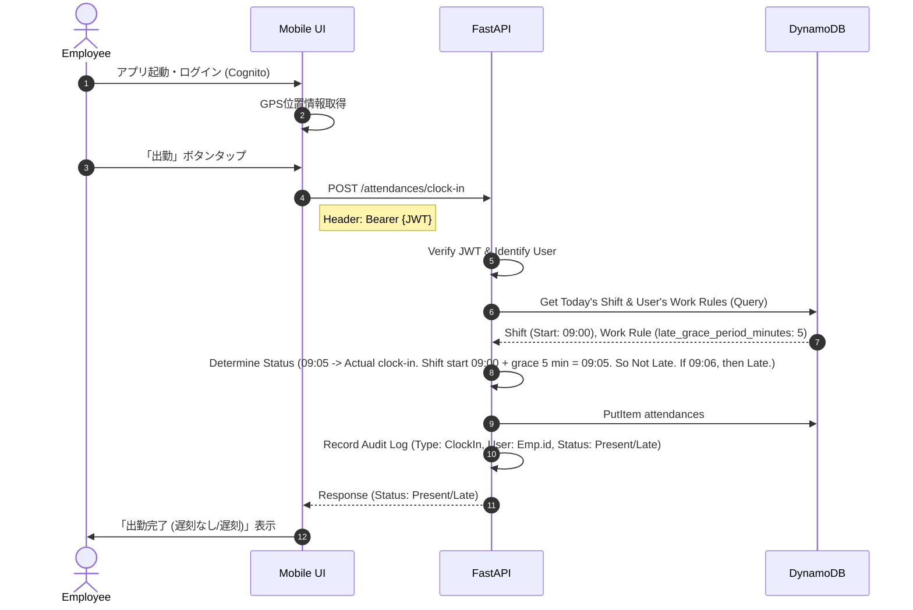
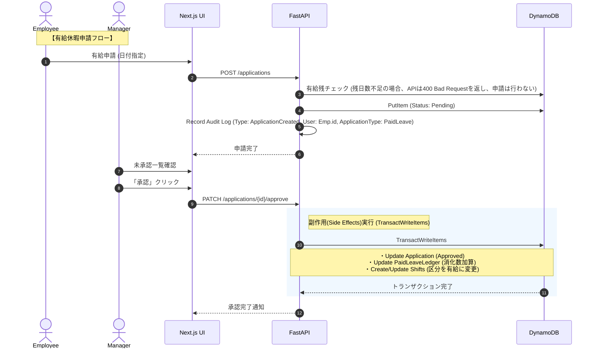
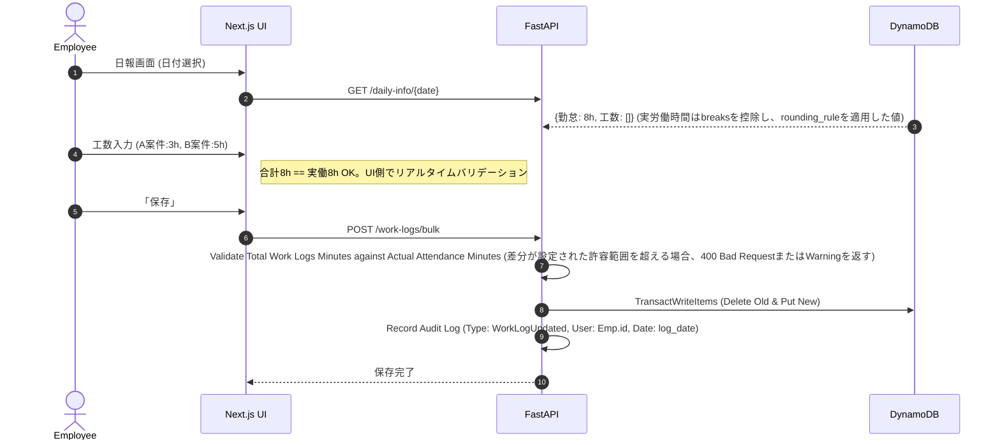
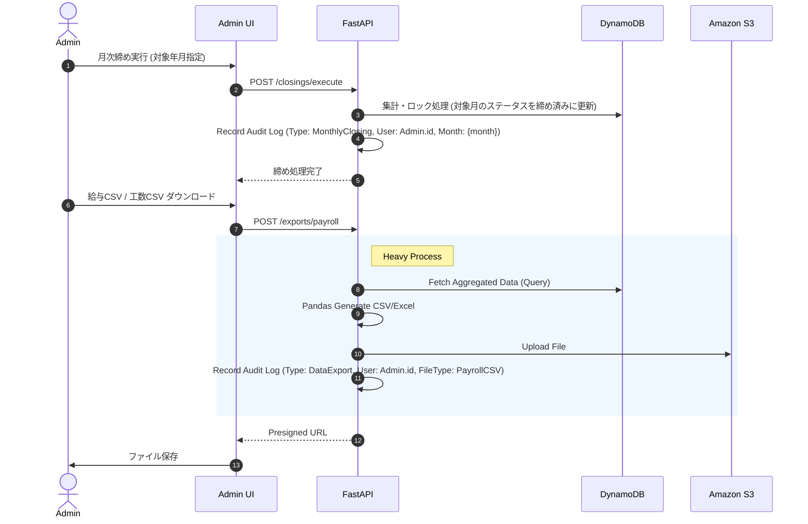

# design.md

---

## 1. プロジェクト概要 (Overview)

### 1.1 プロジェクト名
    **HR-Connect (仮)**

### 1.2 目的・解決したい課題
*   **オールインワン労務管理:** 既存ツール（ジョブカン等）が持つ「勤怠管理」「シフト管理」「ワークフロー（諸届申請）」に加え、「工数管理（日報）」を単一のプラットフォームで統合管理する。
*   **プロジェクト収支の可視化:** 従業員が「どのプロジェクトの・どの作業に・何時間使ったか」を記録し、案件ごとの人件費コストを正確に算出可能にする。
*   **申請と勤怠の自動連動:** 休暇申請や残業申請が承認された際、自動的に勤怠データや有給残日数へ反映させ、手作業による転記ミスをゼロにする。
*   **複雑な就業ルールの吸収:** フレックス、変形労働制、36協定（残業上限）チェックなど、日本の複雑な労務管理に対応する。これらルールは`work_rules.config`のJSONBスキーマ定義に基づき、柔軟に設定・管理される。
*   **セキュアな基盤:** Amazon Cognitoを用いた堅牢な認証と、AWSサーバーレス構成によるスケーラビリティを確保する。

### 1.3 ターゲットユーザー
*   **一般従業員:**
    *   スマホでのGPS打刻、シフト確認。
    *   日報としての工数入力（案件・作業内容・進捗）。
    *   休暇・残業・打刻修正の申請。
*   **管理者（PM・店長・部門長）:**
    *   シフト作成・調整。
    *   申請の承認・差し戻し。
    *   プロジェクト別工数の予実確認、部下の働きすぎ防止（36協定アラート）。
*   **人事・労務・経理:**
    *   全社の月次締め処理。
    *   給与計算ソフト（弥生/freee等）連携データの出力。
    *   組織マスタ・就業規則マスタの管理。

---

## 2. アーキテクチャ構成 (Architecture)

AWSサーバーレス構成を採用し、運用コストの最適化と突発的なアクセス（朝9時の打刻ラッシュ等）への耐性を確保します。

### 2.1 技術スタック選定

| カテゴリ | 技術・ツール | 選定理由 |
| :--- | :--- | :--- |
| **Frontend** | **Next.js (App Router)** | PC管理画面（グリッド表示・ガントチャート）の高速描画と、スマホ打刻画面のレスポンシブ対応を両立。 |
| **Backend** | **FastAPI (Python)** | 型安全性(Pydantic)と、複雑なデータ処理(Pandas)が必要な「工数集計」「Excel生成」「残業計算」に適している。 |
| **Compute** | **AWS Lambda** | サーバー管理不要. Mangumアダプタ経由でFastAPIを稼働させ、リクエストベースで課金。 |
| **Database** | **Amazon DynamoDB** | 完全サーバーレスのNoSQLデータベース。シングルテーブル設計（Single Table Design）を採用し、テーブル結合を必要としないフラットなデータ構造で構築。10人規模の利用であればほぼ完全無料枠内に収まり、アイドル時の維持コストをゼロに抑える。 |
| **Auth** | **Amazon Cognito** | ユーザー認証（User Pools）、MFA、グループ管理（Admin/User）をマネージドサービスに委譲し、セキュアに保つ。 |
| **Storage** | **Amazon S3** | 生成された帳票（Excel/CSV）の一時保存、および申請時の添付ファイル保存先。S3バケットはSSE-S3またはSSE-KMSで暗号化される。 |
| **Infra** | **AWS CDK or Terraform** | インフラ構成のコード管理 (IaC)。 |

### 2.2 システム構成図

```mermaid
graph TD
    User((User/Admin))
    
    subgraph "Frontend"
        NextJS[Next.js App]
        Geo[Geolocation API]
    end

    subgraph "Authentication"
        Cognito[Amazon Cognito\n(User Pools)]
    end

    subgraph "Backend API (AWS Serverless)"
        APIGw[API Gateway]
        Lambda[AWS Lambda (FastAPI)]
    end

    subgraph "Data Persistence"
        DynamoDB[(Amazon DynamoDB\nSingle Table Design)]
        S3[Amazon S3\n(Exports/Files)]
    end

    User -->|HTTPS| NextJS
    NextJS -->|1. Login/Auth| Cognito
    Cognito -->>|JWT Token| NextJS
    
    NextJS -->|2. GPS Data| Geo
    NextJS -->|3. API Req + JWT| APIGw
    
    APIGw -->|Proxy| Lambda
    Lambda -->|Verify JWT| Cognito
    Lambda -->|boto3 / aioboto3| DynamoDB
    Lambda -->|CSV/Excel Gen| S3
    Lambda -->|Presigned URL| NextJS
```

-----

## 3. データモデル (Data Model)

Amazon DynamoDBを採用し、**シングルテーブル設計 (Single Table Design)** によってすべてのエンティティを単一の物理テーブル `HRConnectTable` に統合管理します。これにより、インデックス作成費用やDB管理コストを最小化します。

### 3.1 キー設計とGSI定義

#### プライマリキー (Primary Key)
* **パーティションキー (PK)**: `String` (例: `USER#<user_id>`)
* **ソートキー (SK)**: `String` (例: `METADATA`, `SHIFT#<date>`)

#### グローバルセカンダリインデックス (GSI1)
管理者画面などで特定日付の全従業員の打刻やシフトを検索しやすくするため、PKとSKの役割を入れ替えた反転インデックスを作成します。
* **GSI1-PK**: `SK` (パーティションキーとして検索に使用)
* **GSI1-SK**: `PK`

---

### 3.2 シングルテーブル設計レイアウト (Table Layout)

1つのDynamoDBテーブルに格納される各アイテムのキー設計と代表的な属性は以下の通りです。

| エンティティ (Entity) | PK (Partition Key) | SK (Sort Key) | GSI1-PK (SK) | GSI1-SK (PK) | 属性 (Attributes) |
| :--- | :--- | :--- | :--- | :--- | :--- |
| **User (ユーザー)** | `USER#<cognito_sub>` | `METADATA` | `METADATA` | `USER#<cognito_sub>` | `email`, `name`, `role`, `department_id`, `work_rule_id`, `status` |
| **Department (部門)** | `DEPT#<department_id>` | `METADATA` | `METADATA` | `DEPT#<department_id>` | `name`, `manager_id` |
| **Shift (シフト予定)** | `USER#<user_id>` | `SHIFT#<date>` | `SHIFT#<date>` | `USER#<user_id>` | `start_time`, `end_time`, `is_holiday`, `shift_type`, `remarks` |
| **Attendance (勤怠実績)** | `USER#<user_id>` | `ATTENDANCE#<date>` | `ATTENDANCE#<date>` | `USER#<user_id>` | `clock_in`, `clock_out`, `breaks` (List), `meta_data` (Map), `status`, `total_work_minutes` |
| **WorkLog (工数実績)** | `USER#<user_id>` | `WORKLOG#<date>#<project_id>` | `WORKLOG#<date>#<project_id>` | `USER#<user_id>` | `task_category_id`, `minutes`, `comment` |
| **Project (プロジェクト)** | `PROJECT#<project_id>` | `METADATA` | `METADATA` | `PROJECT#<project_id>` | `code`, `name`, `start_date`, `end_date`, `is_active`, `budget_minutes`, `leader_id` |
| **Application (各種申請)** | `USER#<user_id>` | `APP#<created_at>#<app_id>` | `APP#<created_at>#<app_id>` | `USER#<user_id>` | `template_id`, `type`, `status` (Pending/Approved/Rejected), `input_data` (Map), `approver_id` |
| **PaidLeaveLedger (有給台帳)** | `USER#<user_id>` | `LEAVE_LEDGER#<grant_date>` | `LEAVE_LEDGER#<grant_date>` | `USER#<user_id>` | `expire_date`, `days_granted`, `days_used` |
| **ShiftTemplate (シフト定型)**| `SHIFT_TEMP#<temp_id>`| `METADATA` | `METADATA` | `SHIFT_TEMP#<temp_id>`| `name`, `start_time`, `end_time`, `break_time` |
| **ApplicationTemplate (申請定型)**| `APP_TEMP#<temp_id>`| `METADATA` | `METADATA` | `APP_TEMP#<temp_id>`| `name`, `type`, `schema_definition` (Map) |

---

### 3.3 属性のオブジェクト構造定義

本セクションでは、MapやList型としてネストして保持される属性のJSONスキーマを記述します。これらはFastAPI側のPydanticモデルにて検証を行います。

#### 3.3.1 `work_rules.config` スキーマ
```json
{
  "type": "object",
  "properties": {
    "rounding_rule_minutes": { "type": "integer", "description": "打刻の丸め単位（分）。例: 15", "default": 1 },
    "auto_break_deduction_minutes": { "type": "integer", "description": "自動休憩控除時間（分）。例: 60", "default": 0 },
    "late_grace_period_minutes": { "type": "integer", "description": "遅刻と判定されない許容時間（分）。例: 5", "default": 0 },
    "overtime_thresholds": {
      "type": "array",
      "items": {
        "type": "object",
        "properties": {
          "month_hours": { "type": "integer", "description": "月間残業時間閾値（時間）。例: 45" },
          "period_start_date": { "type": "string", "format": "date", "description": "適用開始日（YYYY-MM-DD）。例: 2023-04-01" },
          "period_end_date": { "type": "string", "format": "date", "description": "適用終了日（YYYY-MM-DD）。例: 2024-03-31" }
        },
        "required": ["month_hours", "period_start_date", "period_end_date"]
      },
      "description": "36協定の残業時間閾値リスト"
    }
  },
  "required": ["rounding_rule_minutes", "auto_break_deduction_minutes"]
}
```

#### 3.3.1.1 補足: 打刻の丸め仕様 (Implementation Detail)
バックエンド(`calculator.py`)では、以下の丸め処理が実装されています。
*   **出勤(Clock-in)**: 設定された `rounding_rule_minutes` 単位で **切り上げ(ceil)**。
*   **退勤(Clock-out)**: 設定された `rounding_rule_minutes` 単位で **切り捨て(floor)**。
*   **デフォルト**: 設定がない場合は1分単位（丸めなし）。

#### 3.3.2 `attendances.breaks` スキーマ
```json
{
  "type": "array",
  "items": {
    "type": "object",
    "properties": {
      "start": { "type": "string", "format": "date-time", "description": "休憩開始時刻 (ISO 8601)" },
      "end": { "type": "string", "format": "date-time", "description": "休憩終了時刻 (ISO 8601)" }
    },
    "required": ["start", "end"]
  }
}
```

#### 3.3.3 `attendances.meta_data` スキーマ
```json
{
  "type": "object",
  "properties": {
    "gps": {
      "type": "object",
      "properties": {
        "latitude": { "type": "number" },
        "longitude": { "type": "number" },
        "accuracy": { "type": "number", "description": "GPS精度（メートル）" }
      }
    },
    "ip_address": { "type": "string", "format": "ipv4" },
    "device_info": { "type": "string", "description": "ユーザーエージェントなどデバイス識別情報" }
  }
}
```

#### 3.3.4 `applications.input_data` スキーマ
このフィールドのスキーマは、`application_templates`テーブルに格納されるJSON Schema（`application_templates.schema_definition`など）に基づいて動的に決定されます。以下は一例です。

**例: 有給休暇申請の`input_data`スキーマ**
```json
{
  "type": "object",
  "properties": {
    "leave_start_date": { "type": "string", "format": "date" },
    "leave_end_date": { "type": "string", "format": "date" },
    "leave_type": { "type": "string", "enum": ["FullDay", "HalfDayMorning", "HalfDayAfternoon"] },
    "reason": { "type": "string" }
  },
  "required": ["leave_start_date", "leave_end_date", "leave_type"]
}
```

-----

## 4. 業務フロー / ユースケース (Business Logic)

### 4.1 打刻と予実判定フロー (Stamping)

ユーザーはCognitoで認証後、位置情報と共に打刻します。システムは即座にシフトと比較し、`work_rules.config.late_grace_period_minutes`に基づいて遅刻判定を行います。



### 4.2 申請承認と自動反映フロー (Workflow Automation)

休暇申請などが承認された場合、勤怠データや有給残日数へ自動的に副作用（Side Effect）を適用します。



### 4.3 工数入力フロー (Man-hour Management)

1日の終わりに、実労働時間と整合性が取れるようプロジェクト別工数を入力します。



### 4.4 月次締め・データ出力 (Closing & Export)



-----

## 5. 実装ルール (Rules for AI)

Cursor (AI) に対する具体的な実装指示です。

### 5.1 ディレクトリ構成 (Monorepo)

```text
/
├── frontend/          # Next.js (TypeScript)
│   ├── src/app/
│   │   ├── (auth)/login/       # Cognito Login
│   │   ├── (user)/stamp/       # スマホ打刻
│   │   ├── (user)/applications/# 申請作成
│   │   ├── (user)/daily-report/# 工数入力
│   │   ├── (admin)/shifts/     # シフト管理
│   │   ├── (admin)/approvals/  # 承認管理
│   │   ├── (admin)/analytics/  # 工数分析
│   │   ├── (admin)/users/      # ユーザー管理
│   │   ├── (admin)/departments/# 部門管理
│   │   └── (admin)/paid-leaves/# 有給休暇管理
│   └── src/lib/       # API Clients, Auth Utils
│
├── backend/           # FastAPI (Python)
│   ├── app/
│   │   ├── core/      # Config, Security (JWT Verify)
│   │   ├── api/       # Routers
│   │   │   ├── endpoints/ # 各機能のエンドポイント
│   │   │   │   ├── attendances.py, shifts.py, applications.py, projects.py,
│   │   │   │   ├── work_logs.py, users.py, departments.py, closings.py,
│   │   │   │   ├── paid_leaves.py, dashboard.py, exports.py, audit_logs.py,
│   │   │   │   ├── system_definitions.py, etc.
│   │   │   └── api.py     # ルーターの統合
│   │   ├── models/    # SQLAlchemy Models (DB definition)
│   │   ├── schemas/   # Pydantic Schemas (API IO)
│   │   ├── services/  # Business Logic
│   │   │   ├── calculator.py   # 残業・深夜計算, 打刻丸め
│   │   │   ├── workflow.py     # 承認・却下アクション
│   │   │   ├── side_effect.py  # 承認時の自動更新 (有給/打刻修正)
│   │   │   ├── alert.py        # 36協定アラート判定
│   │   │   ├── attendance_service.py # 勤怠・シフト関連統合ロジック
│   │   │   ├── project_service.py  # プロジェクト・工数管理
│   │   │   ├── exporter.py     # CSV/Excel生成
│   │   │   └── auditor.py      # 監査ログ記録
│   │   └── db/        # Session Manager
│   ├── alembic/       # DB Migrations
│   ├── main.py        # Application Entrypoint
│   └── requirements.txt
│
└── infra/             # AWS CDK or Terraform
```

### 5.2 コーディング規約・制約

1.  **認証・認可 (Auth):**

    *   バックエンドAPIは `Depends(get_current_user)` を使用し、CognitoのJWTトークンを検証すること。
    *   管理者機能には `Depends(check_admin_role)` を付与し、権限のないアクセスを遮断すること。
    *   **ロールと権限:**
        *   `Admin`: 全ての管理機能へのアクセス権限を持つ。
        *   `Manager`: 部下のシフト作成・調整、申請承認・差し戻し、部下の工数予実確認、36協定アラート確認の権限を持つ。
        *   `Leader`: 特定プロジェクトの管理、メンバーの工数確認。
        *   `HR_Payroll`: 全社の月次締め処理、給与計算ソフト連携データの出力、組織マスタ・就業規則マスタの管理権限を持つ。
        *   `Employee`: 自身の打刻、シフト確認、工数入力、各種申請の権限を持つ。
        これらのロールは `User.role` カラムおよび Cognito のグループに基づき、API の `Depends(check_role)` で認可される。

2.  **データベース処理:**

    *   **SDK/Driver**: **boto3** または **aioboto3** を使用。
    *   **JSON属性**: work_rules の設定や application_templates のスキーマ定義にはMap/List型を活用し、Pydanticでバリデーションを行うこと。詳細スキーマは#3.3参照すること。

3.  **ロジック実装:**

    *   **36協定アラート:** 月次集計時に残業時間をチェックし、`work_rules.config.overtime_thresholds`で定義された閾値（例: 通常月45時間、特定期間60時間）を超えそうな場合はAPIレスポンスに警告フラグを含めること。閾値は設定により変更可能である。
    *   **副作用 (Side Effects):** 申請承認時のデータ更新（有給消化・シフト変更・勤怠実績生成）は、必ずトランザクション内で実行し、整合性を保つこと。
    *   **工数バリデーション:** 工数入力時、プロジェクトの有効期限切れチェックや、実働時間との突合を行うこと（設定によりWarning/Errorを切り替え）。合計工数が実働時間から許容誤差（例: ±15分）を超える場合、`400 Bad Request`を返すか、警告を表示する。

4.  **ファイル生成:**

    *   Excel生成には `openpyxl`、CSV生成・データ加工には `pandas` を使用する。
    *   大量データのエクスポート時はLambdaのメモリ不足を防ぐため、ストリーム処理またはS3へのマルチパートアップロードを実装する。

5.  **UI/UX:**

    *   **スマホファースト:** 打刻、申請、承認はスマートフォンでの操作性を最優先する。
    *   **UIライブラリ:** Shadcn/ui (Tailwind CSS) を使用する。

6.  **日付形式の厳格化と変更禁止:**
    *   すべての画面表示および入力インターフェースにおいて **`YYYY/MM/DD`** 形式での統一を必須とします。
    *   ブラウザのロケール設定により、インプット欄が自動的に `MM/DD/YYYY` などに切り替わらないよう、`<input type="date">` の直接使用は原則禁止し、共通の `DateInput` コンポーネントを使用すること。
    *   API送信時には内部的に `YYYY-MM-DD` 形式に正規化して送信すること。
    *   このルールは変更指示のない限り厳格に適用され、変更は一切禁止とします。

-----

## 6. エラーハンドリング・エラーコード

APIは以下の共通エラーレスポンスフォーマットに従うこと。

```json
{
  "code": "string",       // サービス固有のエラーコード
  "message": "string",    // ユーザーまたは開発者向けのエラーメッセージ
  "details": {}           // エラー詳細（バリデーションエラーの場合、フィールドごとのエラーなど）
}
```

**主なエラーコード例:**
*   `AUTH_001`: 認証情報が無効です。
*   `AUTH_002`: 権限が不足しています。
*   `VALIDATION_001`: リクエストデータが無効です。
*   `DATA_001`: 指定されたリソースが見つかりません。
*   `BUSINESS_001`: 申請に必要な有給残日数が不足しています。
*   `BUSINESS_002`: 工数の合計が実労働時間と大きく異なります。
*   `SYSTEM_001`: システムエラーが発生しました。

HTTPステータスコードとエラーコードの対応を明確にすること。例: `401 Unauthorized` for `AUTH_001`, `403 Forbidden` for `AUTH_002`, `400 Bad Request` for `VALIDATION_001`.

-----

## 7. 監査ログ要件

システム内の主要な操作は監査ログとして記録され、セキュリティおよびコンプライアンス要件を満たすこと。監査ログは変更不能な形でS3に保存され、CloudWatch Logs経由でアクセス可能とする。

**記録対象イベント:**
*   ユーザー認証関連: ログイン成功/失敗、ログアウト、パスワード変更、MFA設定変更。
*   データ操作: データの作成 (C), 読み取り (R), 更新 (U), 削除 (D)。特に`users`, `work_rules`, `shifts`, `attendances`, `work_logs`, `applications`, `paid_leave_ledgers`テーブルへの変更。
*   承認ワークフロー: 申請の提出、承認、却下、差し戻し。
*   システム管理操作: 月次締め処理、マスタデータ更新、データエクスポート。

**記録内容:**
*   `timestamp`: 操作日時 (UTC)
*   `user_id`: 操作を行ったユーザーのID
*   `user_ip_address`: 操作元のIPアドレス
*   `event_type`: イベントの種類（例: `USER_LOGIN_SUCCESS`, `ATTENDANCE_CREATED`, `APPLICATION_APPROVED`）
*   `target_resource_type`: 操作対象のリソースタイプ（例: `User`, `Attendance`, `Application`）
*   `target_resource_id`: 操作対象のリソースID
*   `details`: 変更内容의サマリーまたは変更前後の差分 (JSON形式)。特に機密情報を含まないように注意。
*   `result`: 操作結果（成功/失敗）

**保存期間:**
*   最低7年間 (日本の法規制に準拠)

**アクセス方法:**
*   CloudWatch Logsから検索・閲覧可能。
*   必要に応じてS3から直接取得。
